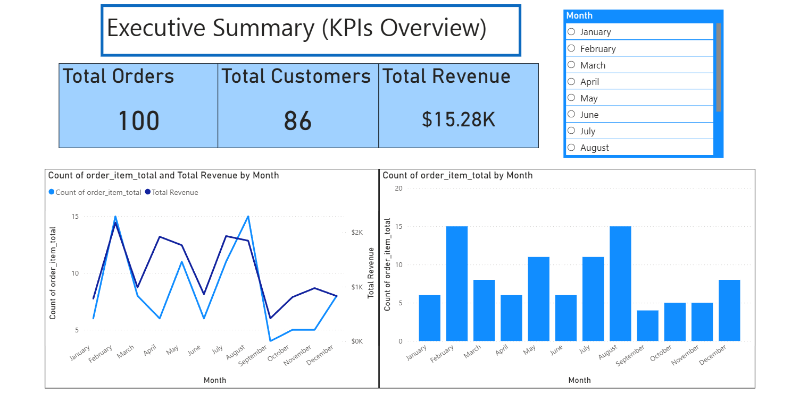
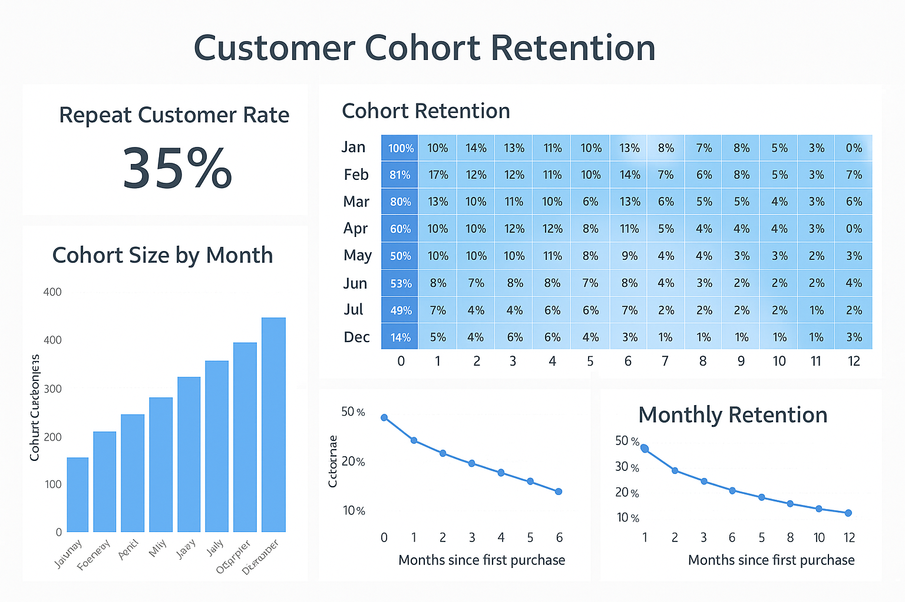
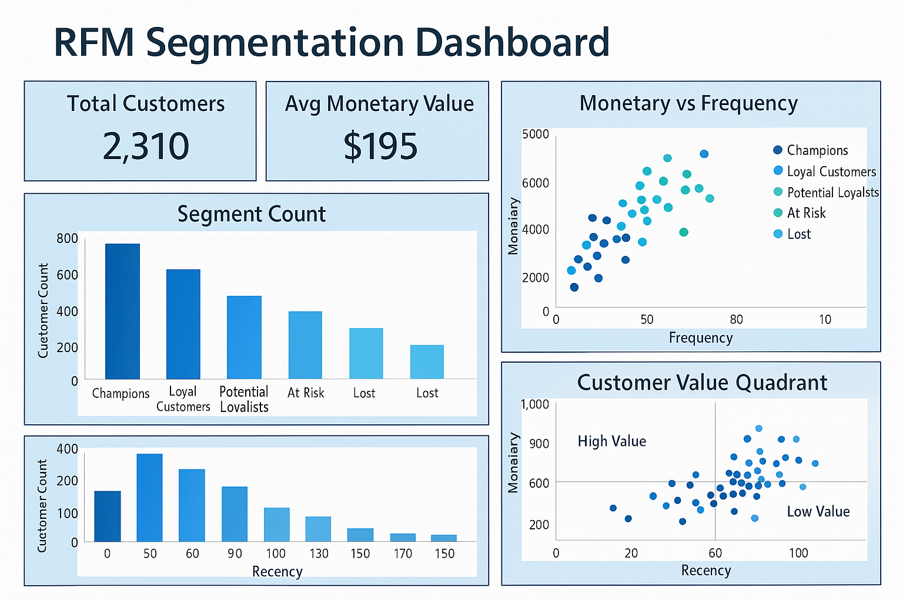

E-Commerce Customer Analytics (Olist Dataset)

End-to-End Data Engineering & Analytics Project on Google Cloud Platform (GCP)
SQL • BigQuery • Python • Cloud Composer • Cloud Run • Cloud Storage • Power BI

🌟 Project Summary

This project builds a complete cloud-based analytics pipeline to help an e-commerce business understand:

Customer retention & churn patterns

Repeat purchase behavior (cohorts)

Customer value using RFM segmentation

Revenue & order trends

High-value vs at-risk customers

Using GCP services, SQL modeling, Python processing, and Power BI dashboards, I built a production-ready analytics workflow from raw data → insights.

🚀 Architecture (GCP)

Below is the pipeline implemented in this project:

Raw CSVs → Cloud Storage → BigQuery (SQL Models)
        → Cloud Composer (Orchestration)
        → Cloud Run (Python RFM/Cohort jobs)
        → Power BI Dashboards → PNG Exports

✔ Cloud Components Used
Component	Purpose
Cloud Storage	Raw data landing zone & processed exports
BigQuery	Data warehouse, cohort models, RFM scoring
Cloud Composer (Airflow)	Scheduled SQL & ETL orchestration
Cloud Run	Python scripts for RFM segmentation & cohort enrichment
Power BI	Dashboards & business insights
Cloud Monitoring	Pipeline health monitoring & alerts
📊 Dashboards (Power BI)
1️⃣ Executive KPI Dashboard

✔ Total Orders
✔ Total Customers
✔ Total Revenue
✔ Monthly revenue & order trends

2️⃣ Customer Cohort Retention Dashboard

✔ Cohort Heatmap
✔ Retention trend line
✔ Cohort size by month
✔ Repeat customer rate KPI

3️⃣ RFM Segmentation Dashboard

✔ Segment distribution (Champions, Loyal, At-Risk, Lost)
✔ Monetary vs Frequency scatter
✔ Recency distribution histogram
✔ High-value vs low-value quadrant
✔ RFM KPI tiles

📁 Dashboard PNGs are included in /dashboards/.

🛠️ Tech Stack
Google Cloud Platform

BigQuery

Cloud Storage

Cloud Composer (Airflow)

Cloud Run (serverless Python jobs)

Cloud Monitoring

IAM Roles + Service Accounts

Data Engineering

SQL (BigQuery Standard SQL)

Python (Pandas, NumPy)

ETL pipelines

Data modeling (Star schema views, cohort tables, RFM tables)

Visualization

Power BI

DAX measures

KPI cards, slicers, heatmaps, scatter plots

🧠 Features Implemented
Customer Cohort Analysis

First purchase month as cohort index

Month-over-month retention

Customer lifecycle decay patterns

Identified churn window (2–3 months)

RFM Segmentation

Recency (days since last order)

Frequency (order count)

Monetary (total spend)

Quantile-based scoring (1–5)

Segments:

⭐ Champions

❤️ Loyal Customers

🔍 Potential Loyalists

⚠️ At Risk

❌ Lost

Business Insights

Champions & Loyal customers account for majority of revenue

Retention drops sharply after month 2

High-value customers have 3x higher frequency

At-risk customers identified for re-engagement campaigns

🏗️ Project Structure
📦 e-commerce-customer-analytics-olist
│
├── data/                     # (Sample CSVs only)
├── sql/                      # BigQuery SQL models & views
├── python/                   # RFM and cohort Python jobs
├── dashboards/               # PNG exports of Power BI dashboards
├── powerbi/                  # PBIX file (optional)
├── docs/                     # Architecture diagram, notes
└── README.md

⚙️ How the Pipeline Works (Step-by-Step on GCP)
1️⃣ Cloud Storage — Raw Data Ingestion

Uploaded all Olist CSVs into a raw bucket:

gs://olist-raw-data/

2️⃣ BigQuery — Data Warehouse

Created dataset:

bq mk olist_dataset

Loaded raw tables and wrote SQL transformations for:

Order summary

Cohort tables

RFM base table

RFM scoring

3️⃣ Cloud Composer (Airflow) — Orchestration

DAG tasks:

Load → Transform in BigQuery

Run Cloud Run Python job

Export processed CSVs

Trigger Power BI refresh (optional webhook)

4️⃣ Cloud Run — Python Processing

Python scripts for:

RFM scoring logic

Cohort enrichment

CSV export back to Cloud Storage

5️⃣ Power BI — Visualization Layer

Connected Power BI → BigQuery
Created 3 dashboards
Exported PNGs for GitHub

📈 Results & Impact

Built a cloud-scale analytics system capable of handling large e-commerce datasets

Provided actionable insights for marketing, retention, and revenue strategy

Automated end-to-end pipeline with orchestration & monitoring

Designed professional dashboards for decision-making
